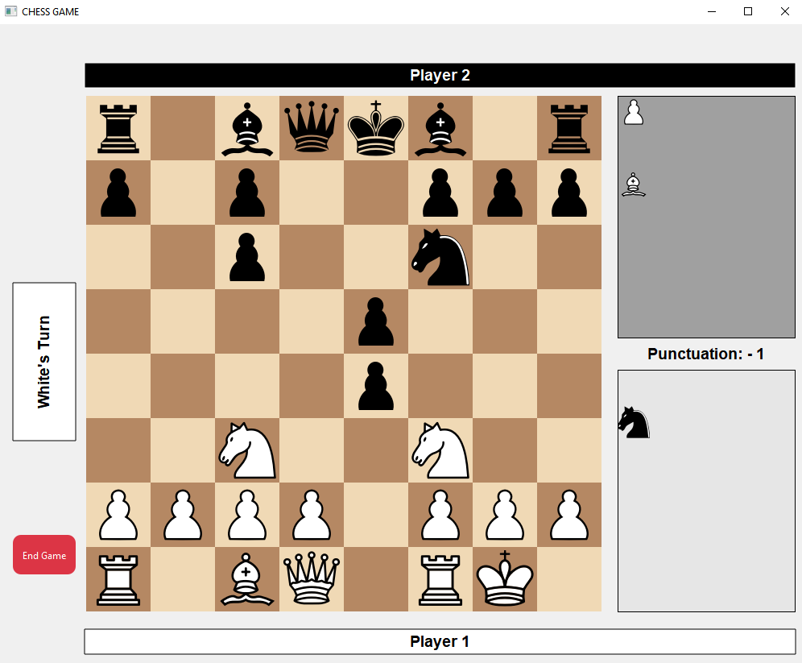

# ChessGame_1v1
## Description
This chess game is implemented with C++ using Qt. It consists of a 1v1 game, without IA.

## Further developement
1. Ending the game after three moves repetition.
2. Shows historial of moves
3. Allow the players to cancel a movement and return back the position.
4. Adding IA player.